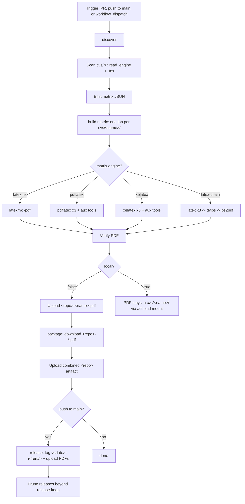

# Curriculum Vitae (LaTeX)

[](https://github.com/stklug84/curriculum-vitae/actions/workflows/build.yml)
[](https://github.com/stklug84/curriculum-vitae/actions/workflows/lint.yml)
[](https://github.com/stklug84/curriculum-vitae/actions/workflows/codeql.yml)
[](https://github.com/stklug84/curriculum-vitae/actions/workflows/dependabot/dependabot-updates)
[](https://www.latex-project.org/)

A multi-variant LaTeX CV repository. Every directory under `cvs/<name>/`
contains exactly one CV main document plus a hidden `.engine` file that
declares the LaTeX engine to use. CI auto-discovers every variant and builds
them in parallel inside a TeX Live container. Any build can be reproduced
locally with the host TeX Live install or by replaying the workflow with
[`nektos/act`](https://github.com/nektos/act) via the GitHub CLI.

## Single source of truth: `data/cv.yml`

All CV content lives in one canonical, bilingual (`de`/`en`) file:
[`data/cv.yml`](data/cv.yml). The per-section LaTeX files each variant
`\input`s are **generated** from it by the
[`stklug84/actions` `cv/parse`](https://github.com/stklug84/actions) action
(major alias `v2`). See [`data/README.md`](data/README.md) for the full
schema, the `targets` contract, and the generate→build flow.

The generated section files are also **committed** under each
`cvs/<variant>/` as a local-build fallback (so the repo builds without
running the action first). Regenerate them after editing `cv.yml`:

```sh
make gen     # regenerate cvs/<variant>/cv-*.tex + personal-info.tex
make check   # validate data/cv.yml against the cv/parse schema
```

Both delegate to `scripts/gen.sh`, which expects a sibling checkout of the
action at `../actions/cv/parse` (override with `ACTION_DIR` / `PARSE_PY`).

Each variant main wraps the generated bodies in its own scaffolding. The
generated files are:

```text
cvs/<variant>/personal-info.tex     # \cv… macros (name, contact, paths)
cvs/<variant>/cv-experience.tex
cvs/<variant>/cv-education.tex
cvs/<variant>/cv-conferences.tex
cvs/<variant>/cv-skills.tex
cvs/<variant>/cv-languages.tex
cvs/<variant>/cv-interests.tex
cvs/<variant>/cv-certifications.tex
```

Today the repo ships two variants:

| Variant            | Folder             | Engine   | Style file                  |
| ------------------ | ------------------ | -------- | --------------------------- |
| Classic two-page   | `cvs/photo-2page/` | pdflatex | `styles/cv-plain-style.sty` |
| Sidebar two-column | `cvs/sidebar/`     | xelatex  | `styles/cv-sidebar.sty`     |

## Downloading the PDFs

Every merge to `main` publishes the built PDFs as a versioned GitHub
release tagged `v<YYYY.MM.DD>-r<run-number>` (see the
[Releases](https://github.com/stklug84/curriculum-vitae/releases) page).
Release assets never expire; only the 10 newest releases are kept
(older ones are pruned automatically, including their tags).

Grab the current PDFs with the GitHub CLI — without a tag this always
resolves to the latest release (`--pattern` is required in that case):

```sh
gh release download -R stklug84/curriculum-vitae -p '*.pdf'
```

Or a specific revision:

```sh
gh release download v2026.06.12-r17 -R stklug84/curriculum-vitae
```

PR builds additionally upload short-lived workflow artifacts for review
(see [Artifact names](#artifact-names)).

## Repository layout

```text
.
├── data/
│   ├── cv.yml                    # Single source of truth (bilingual de/en)
│   └── README.md                 # Schema + targets contract
├── styles/
│   ├── cv-plain-style.sty        # Classic two-page CV style (pdflatex)
│   └── cv-sidebar.sty            # Sidebar CV style (xelatex, FiraSans)
├── images/                       # Shared assets (photo, signature)
├── cvs/
│   ├── photo-2page/
│   │   ├── lebenslauf-photo-2page.tex  # Scaffolding; \input generated bodies
│   │   ├── personal-info.tex     # Generated (committed fallback)
│   │   ├── cv-*.tex              # Generated section bodies (committed fallback)
│   │   └── .engine               # contents: pdflatex
│   └── sidebar/
│       ├── lebenslauf-sidebar.tex
│       ├── personal-info.tex     # Generated (committed fallback)
│       ├── cv-*.tex              # Generated section bodies (committed fallback)
│       └── .engine               # contents: xelatex
├── scripts/gen.sh                # Regenerate section files from data/cv.yml
├── Makefile                      # `make gen` / `make check`
├── .github/
│   ├── CODEOWNERS                # Default reviewer: @stklug84
│   ├── dependabot.yml            # Actions + TeX Live digest updates
│   ├── docker/texlive/Dockerfile # Digest pin for the TeX Live image
│   └── workflows/
│       ├── build.yml             # generate (cv/parse) -> latex-build-cv (below)
│       ├── codeql.yml            # CodeQL (actions language)
│       └── lint.yml              # actionlint/yamllint/markdownlint/hadolint/cv-schema
├── .markdownlint.yml             # Markdown lint rules
├── .yamllint.yml                 # YAML lint rules
└── CONTRIBUTING.md               # Conventions and PR checklist
```

Shared assets (`images/` and the `*.sty` files in `styles/`) live at the
repo root and are resolved from inside each variant directory via
`TEXINPUTS=.:../..:../../styles:../../images:`. Each variant's
`personal-info.tex` and `cv-*.tex` are generated per variant (and resolved
first via the leading `.` in `TEXINPUTS`). That setting is applied
automatically by the workflow and is the only thing you need locally too.

## Editing CV content

Content is **not** edited in the `.tex` files — edit
[`data/cv.yml`](data/cv.yml) (bilingual), then run `make gen` to
regenerate the committed section files and `make check` to validate the
schema. See [`data/README.md`](data/README.md). Do not hand-edit the
generated `cv-*.tex` / `personal-info.tex` files; they carry a
"do not edit by hand" banner and are overwritten on regeneration.

## Adding a new CV variant

The workflow is fully data-driven — there is no list of variants to update.
To add a third CV:

1. `mkdir cvs/<name>`
2. Drop exactly one `*.tex` file with `\documentclass{...}` into it. Build
   the document scaffolding and `\input` the generated per-section files
   (`\input{personal-info}`, `\input{cv-experience}`, …). Reference shared
   assets normally (`\usepackage{cv-sidebar}`,
   `\includegraphics{images/photo.jpg}`).
3. `echo <engine> > cvs/<name>/.engine` — one of `latexmk`, `pdflatex`,
   `xelatex`, `latex-chain`. If `.engine` is missing, `latexmk` is used.
4. Add the variant (and its `cv/parse` style) to the `generate` job in
   `.github/workflows/build.yml` and to the `VARIANTS` list in
   `scripts/gen.sh`, then run `make gen` and commit the generated files.
5. Open a pull request (`main` is protected; direct pushes are rejected).
   CI picks the new variant up automatically and uploads
   `<repo>-<name>-pdf` as a workflow artifact for review. After the merge,
   the PDF is also included in the next versioned release.

## Building locally

### Direct (host TeX Live)

`cd` into the variant directory and invoke the engine matching its `.engine`
file. The `TEXINPUTS` setting lets the main `.tex` resolve `personal-info.tex`,
the shared `*.sty` files, and `images/` from the repo root.

```sh
# Classic two-page CV (pdflatex)
cd cvs/photo-2page
TEXINPUTS=.:../..:../../styles:../../images: pdflatex -interaction=nonstopmode -halt-on-error lebenslauf-photo-2page.tex

# Sidebar variant (xelatex)
cd cvs/sidebar
TEXINPUTS=.:../..:../../styles:../../images: xelatex -interaction=nonstopmode -halt-on-error lebenslauf-sidebar.tex
```

`latexmk` users can equivalently run:

```sh
cd cvs/<variant>
TEXINPUTS=.:../..:../../styles:../../images: latexmk -pdf -interaction=nonstopmode -halt-on-error -g <main>.tex
```

The PDF lands next to the source: `cvs/<variant>/<main>.pdf`.

### Via the CI workflow with `gh act`

This replays the exact CI logic on your machine inside the digest-pinned
TeX Live container, so you do not need TeX Live installed on the host.
`act` fetches the remote reusable workflow and the composite actions
(both repositories are public — network access required, no token) and
builds the **full matrix** — every CV variant in one run.

```sh
gh act workflow_dispatch -W .github/workflows/build.yml \
  --input local=true \
  -P ubuntu-latest=catthehacker/ubuntu:act-latest
```

Two flags matter (verified with act 0.2.89):

- `-P ubuntu-latest=catthehacker/ubuntu:act-latest` — act's default
  micro image (`node:16-buster-slim`) lacks `jq`, which the `discover`
  job needs; the medium runner image matches GitHub's toolset.
- On Apple Silicon add `--container-architecture linux/arm64` if the
  TeX Live image was previously pulled as arm64 — act defaults to
  amd64 and the Docker daemon refuses a digest whose local platform
  differs.

`act` exports `ACT=true` automatically, so the workflow also auto-detects
local mode even if you omit `--input local=true`. In local mode the PDFs land
in their variant folders via the bind mount; the upload, package, and
release jobs are skipped.

## CI workflow explained

CI turns every CV variant under `cvs/*/` into a PDF on every pull
request, on every push to `main` (publishing a versioned release), and
on demand via the Actions UI. It is intentionally generic: it
auto-discovers what to build, picks the right engine per variant from
each `.engine` dotfile, and runs the legs in parallel.

The logic is layered across three repositories:

| Layer | Where | Role |
| --- | --- | --- |
| Caller `build.yml` | this repo | Triggers, concurrency, permissions, the `generate` job (cv/parse), repo-specific inputs |
| Composite action `cv/parse` | [`stklug84/actions`](https://github.com/stklug84/actions) (`v2`) | Renders `data/cv.yml` → per-section `.tex` for each variant style |
| Reusable workflow `latex-build-cv.yml` | [`stklug84/github-workflows`](https://github.com/stklug84/github-workflows) (SHA-pinned, `v1.6.0`) | Jobs: `discover` → `build` (matrix, with prebuild download) → `package` → `release` |
| Composite actions `texlive/*` | [`stklug84/actions`](https://github.com/stklug84/actions) (SHA-pinned, `v1.3.0`) | Behavior: `discover-variants`, `build-pdf`, `upload-build-logs` |

The caller in this repo runs a `generate` job (cv/parse per variant,
uploaded as the `cv-generated-tex` artifact) and a thin `build` job that
hands that artifact to the reusable workflow as a *prebuild* (downloaded at
repo root before the TeX Live build):

```yaml
jobs:
  generate:
    runs-on: ubuntu-latest
    steps:
      - uses: actions/checkout@v6
      - uses: stklug84/actions/cv/parse@v2     # plain  -> cvs/photo-2page
        with: {source: data/cv.yml, mode: latex, style: plain,  lang: de, out-dir: cvs/photo-2page}
      - uses: stklug84/actions/cv/parse@v2     # sidebar -> cvs/sidebar
        with: {source: data/cv.yml, mode: latex, style: sidebar, lang: de, out-dir: cvs/sidebar}
      - uses: actions/upload-artifact@v4
        with: {name: cv-generated-tex, path: cvs/**/*.tex, if-no-files-found: error}

  build:
    needs: generate
    # contents: write is consumed only by the called workflow's release
    # job (publishes versioned releases on pushes to main).
    permissions:
      contents: write
    uses: stklug84/github-workflows/.github/workflows/latex-build-cv.yml@<sha>  # v1.6.0
    with:
      texinputs: ".:../..:../../styles:../../images:"
      local: ${{ inputs.local }}
      prebuild-artifact: "cv-generated-tex"   # extracted at repo root before build
      prebuild-into: "."
      release: "true"
      release-keep: "10"
```

Everything below describes what the reusable workflow does with these
inputs.

### Triggers

```yaml
on:
  pull_request:
  push:
    branches:
      - main
  workflow_dispatch:
    inputs:
      local:
        description: "Set to 'true' when running locally via gh act"
        required: false
        default: "false"
        type: string
```

- `pull_request` — builds every CV for every PR so reviewers can download
  the rendered PDFs as artifacts before merging.
- `push` to `main` — builds every CV and publishes the PDFs as a
  versioned GitHub release (see
  [Downloading the PDFs](#downloading-the-pdfs)).
- `workflow_dispatch` — lets you trigger a manual build. The only input is
  `local`, used by `gh act` to skip artifact upload steps.

### Inputs and environment

Inputs this repo passes to the reusable workflow:

| Name | Value here | Purpose |
| --- | --- | --- |
| `texinputs` | `.:../..:../../styles:../../images:` | Lets each `cvs/<name>/<main>.tex` resolve shared assets at the repo root |
| `local` | `workflow_dispatch` input (default `"false"`) | Forces local mode for `gh act` (skips upload/package/release) |
| `release` | `"true"` | Publish a versioned release on pushes to `main` |
| `release-keep` | `"10"` | Keep only the 10 newest releases (older ones pruned, tags included) |

Reusable-workflow inputs left at their defaults:

| Name | Default | Purpose |
| --- | --- | --- |
| `root` | `cvs` | Directory scanned for variants |
| `default-engine` | `latexmk` | Engine for variants without an `.engine` file |
| `texlive-dockerfile` | `.github/docker/texlive/Dockerfile` | Path to the TeX Live digest pin in this repo |
| `runs-on` | `ubuntu-latest` | Runner label for all jobs |

Environment resolved inside the reusable workflow:

| Name | Source | Purpose |
| --- | --- | --- |
| `ARTIFACT_PREFIX` | `${{ github.event.repository.name }}` | Dynamic artifact-name prefix; never hardcoded |
| `ACT` | runner env (set by `nektos/act`) | Auto-detected to switch into local mode |

The engine is **not** a workflow input. It is declared per variant via the
`.engine` dotfile and picked up automatically by `discover`.

### Permissions, timeout, concurrency

```yaml
# Caller (this repo)
permissions:
  contents: read          # workflow default
jobs:
  build:
    permissions:
      contents: write     # consumed only by the release job

concurrency:
  group: build-${{ github.workflow }}-${{ github.ref }}
  cancel-in-progress: true
```

- **Two-level permissions** — the caller's workflow default is
  `contents: read`; only the calling job grants `contents: write`, which
  the reusable workflow's `release` job needs to create releases and
  tags. All other jobs read the repo and upload artifacts.
- `concurrency` — if you push several commits to the same PR in quick
  succession, in-flight builds for older commits are cancelled, saving
  runner minutes.
- `timeout-minutes: 15` per matrix leg (set in the reusable workflow) —
  guards against a runaway LaTeX loop or a broken package burning a
  full hour of runner time.
- `container` — every build step runs inside the official TeX Live image
  (digest-pinned via `.github/docker/texlive/Dockerfile`, resolved by the
  `discover` job), so `latexmk`, `pdflatex`, `xelatex`, `latex`, `dvips`,
  `ps2pdf`, `biber`, `bibtex`, `makeindex` and `makeglossaries` are all
  available without installation.

### Workflow diagram



### Step-by-step walkthrough

All four jobs live in the reusable workflow; the heavy lifting is
further delegated to composite actions from the central
[`stklug84/actions`](https://github.com/stklug84/actions) repository
(SHA-pinned): `texlive/discover-variants`, `texlive/build-pdf`, and
`texlive/upload-build-logs`. The workflow is pure orchestration — the
matrix entry is data, the actions are behavior.

**1. `discover`** — `texlive/discover-variants` scans every directory
under `cvs/`, locates exactly one `*.tex` with `\documentclass` per
folder, reads the sibling `.engine` dotfile (default `latexmk` if
absent), and detects per-main auxiliary toolchain requirements
(`bibtex`, `biblatex`, `makeindex`, `glossaries`, `psfrag`). The result
is emitted as a JSON matrix consumed by `build`.

```yaml
- name: Discover CV variants
  id: scan
  uses: stklug84/actions/texlive/discover-variants@<sha>  # v1.3.0
  with:
    root: cvs
    default-engine: latexmk
```

**2. `build` (matrix)** — one leg per variant via
`strategy.matrix: fromJson(...)` with
`fail-fast: false`. Each leg runs in the digest-pinned TeX Live container
and calls `texlive/build-pdf`, which dispatches on `matrix.engine`
(`latexmk` / `pdflatex` / `xelatex` / `latex-chain`), runs aux tools only
when `matrix.has_*` flags say they are needed, and verifies the PDF.

```yaml
build:
  needs: discover
  strategy:
    fail-fast: false
    matrix: ${{ fromJson(needs.discover.outputs.matrix) }}
  container:
    image: ${{ needs.discover.outputs.texlive-image }}
  steps:
    - uses: actions/checkout@v6
    - name: Build ${{ matrix.name }} (${{ matrix.engine }})
      uses: stklug84/actions/texlive/build-pdf@<sha>  # v1.3.0
      with:
        working-directory: ${{ matrix.dir }}
        main: ${{ matrix.main }}
        engine: ${{ matrix.engine }}
        texinputs: ".:../..:../../styles:../../images:"
        # ... has-* flags from the matrix ...
    - name: Upload PDF artifact
      if: needs.discover.outputs.local != 'true'
      uses: actions/upload-artifact@v7
      with:
        name: ${{ env.ARTIFACT_PREFIX }}-${{ matrix.name }}-pdf
        path: ${{ matrix.dir }}/${{ matrix.main }}.pdf
```

**3. `package`** — runs after all matrix legs succeed and downloads every
`${{ env.ARTIFACT_PREFIX }}-*-pdf` artifact, then republishes them as a
single combined `${{ env.ARTIFACT_PREFIX }}` artifact with each PDF in its
own subdirectory.

```yaml
package:
  needs: [discover, build]
  if: needs.discover.outputs.local != 'true'
  steps:
    - uses: actions/download-artifact@v8
      with:
        pattern: ${{ env.ARTIFACT_PREFIX }}-*-pdf
        path: ./dist
    - uses: actions/upload-artifact@v7
      with:
        name: ${{ env.ARTIFACT_PREFIX }}
        path: ./dist/*
```

**4. `release`** — opt-in (`release: "true"`), push events only. Downloads
the per-CV artifacts, flattens them, and publishes a GitHub release
tagged `v<YYYY.MM.DD>-r<run-number>` via the `gh` CLI (no third-party
actions). GitHub marks the newest release as *Latest*. When
`release-keep` is non-zero, older releases matching the workflow's tag
pattern are deleted together with their tags; manually created releases
are never touched.

```yaml
release:
  needs: [discover, package]
  if: >-
    inputs.release == 'true' &&
    github.event_name == 'push' &&
    needs.discover.outputs.local != 'true'
  permissions:
    contents: write
  steps:
    # download artifacts -> flatten PDFs -> gh release create
    # "v$(date +%Y.%m.%d)-r${GITHUB_RUN_NUMBER}" -> prune to release-keep
```

### Artifact names

All artifact names are derived from `${{ github.event.repository.name }}`
(the workflow-level `ARTIFACT_PREFIX`) and the per-folder variant name. No
artifact name is hardcoded; adding a new `cvs/<X>/` folder automatically
yields a corresponding artifact.

| Artifact | Pattern | Example (this repo, `curriculum-vitae`) |
| --- | --- | --- |
| Per-CV PDF | `<repo>-<name>-pdf` | `curriculum-vitae-photo-2page-pdf`, `curriculum-vitae-sidebar-pdf` |
| Per-CV logs (failure) | `<repo>-<name>-logs` | `curriculum-vitae-photo-2page-logs` |
| Combined | `<repo>` | `curriculum-vitae` |

### Engine selection guide

Set the engine per variant by writing one of the following keywords into
`cvs/<name>/.engine`:

| Engine value | When to use | Why |
| --- | --- | --- |
| `latexmk` | Default for most CVs | Auto-runs the right number of passes plus `biber` / `bibtex` / `makeindex` / `makeglossaries` |
| `pdflatex` | Classic pdfLaTeX three-pass build | Lower-level; useful for debugging pass-by-pass |
| `xelatex` | Documents using OpenType fonts (e.g. Fira Sans via `fontspec`) | Required by `cv-sidebar.sty` and any `fontspec`-based style |
| `latex-chain` | Documents using `psfrag` | `psfrag` substitutions are applied by `dvips` at the PostScript stage; `pdflatex` / `xelatex` skip them |

If you select `pdflatex` or `xelatex` but the document `\usepackage{psfrag}`s
anything, the workflow fails fast with a clear remediation hint instead of
producing a PDF with un-substituted markers.

### Where the PDF lands

| Run mode | Location |
| --- | --- |
| GitHub Actions (PR or `workflow_dispatch`) | Workflow artifacts `<repo>-<name>-pdf` per variant, plus combined `<repo>` |
| GitHub Actions (push to `main`) | Same artifacts, plus a versioned release `v<date>-r<run#>` with all PDFs |
| `gh act` (local) | `cvs/<name>/<main>.pdf` in your working tree (via bind mount) |

## Known caveats and future improvements

- **Container pinning**: the TeX Live image is pinned by digest in
  `.github/docker/texlive/Dockerfile` (single source of truth; the workflow
  reads its `FROM` line). Dependabot's docker ecosystem bumps the digest as
  upstream `texlive/texlive:latest` moves. Dependabot has no CTAN / TeX Live
  package ecosystem, so individual LaTeX packages are not tracked — the
  container digest is the LaTeX-toolchain version pin.
- **Central pins need manual bumps**: the reusable workflow
  (`latex-build-cv.yml`) and the composite actions it uses are SHA-pinned.
  Dependabot bumps the reusable-workflow pin in this repo; the composite
  action pins live inside `stklug84/github-workflows` and are bumped
  there. New central releases only take effect here after the pin is
  updated.
- **Release retention**: only the 10 newest releases are kept
  (`release-keep: "10"`). Pruned releases are deleted **including their
  PDFs and tags** — older CV revisions are gone for good. Anyone with
  read access can download any release still present.
- **`gh act` needs the medium runner image**: the default micro image
  lacks `jq` (used by `discover`), so pass
  `-P ubuntu-latest=catthehacker/ubuntu:act-latest`; on Apple Silicon a
  consistent `--container-architecture` may also be required (see
  [Building locally](#via-the-ci-workflow-with-gh-act)).
- **No `tlmgr` cache**: the workflow does not install extra TeX packages, so
  no caching is needed today. Add an `actions/cache` step if package
  installation is introduced later.
- **One main per folder**: `discover` enforces exactly one `*.tex` with
  `\documentclass` per `cvs/<name>/`. Use one folder per CV variant.
