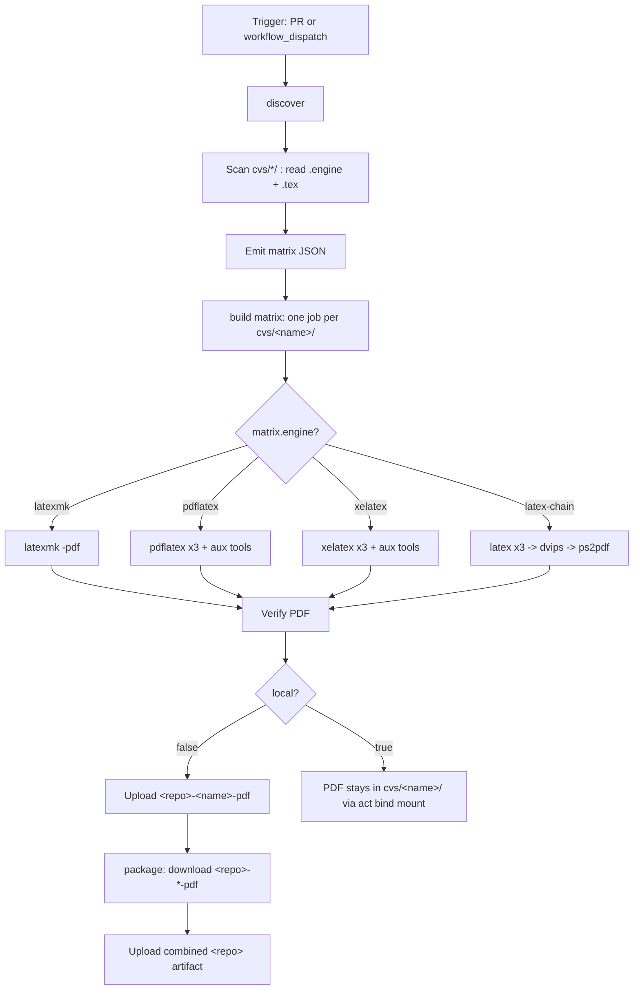

# Curriculum Vitae (LaTeX)

A multi-variant LaTeX CV repository. Every directory under `cvs/<name>/`
contains exactly one CV main document plus a hidden `.engine` file that
declares the LaTeX engine to use. CI auto-discovers every variant and builds
them in parallel inside a TeX Live container. Any build can be reproduced
locally with the host TeX Live install or by replaying the workflow with
[`nektos/act`](https://github.com/nektos/act) via the GitHub CLI.

Today the repo ships two variants:

| Variant            | Folder              | Engine    | Style file         |
| ------------------ | ------------------- | --------- | ------------------ |
| Classic two-page   | `cvs/photo-2page/`  | pdflatex  | `cv-plain-style.sty` |
| Sidebar two-column | `cvs/sidebar/`      | xelatex   | `cv-sidebar.sty`   |

## Repository layout

```
.
├── cv-plain-style.sty            # Classic two-page CV style (pdflatex)
├── cv-sidebar.sty                # Sidebar CV style (xelatex, FiraSans)
├── personal-info.tex             # Shared name / contact / asset paths
├── images/                       # Shared assets (photo, signature)
├── cvs/
│   ├── photo-2page/
│   │   ├── lebenslauf-photo-2page.tex
│   │   └── .engine               # contents: pdflatex
│   └── sidebar/
│       ├── lebenslauf-sidebar.tex
│       └── .engine               # contents: xelatex
└── .github/workflows/build.yml
```

Shared assets (`personal-info.tex`, `images/`, and the two `*.sty` files)
live at the repo root and are resolved from inside each variant directory
via `TEXINPUTS=.:../..:../../images:`. That setting is applied automatically
by the workflow and is the only thing you need locally as well.

## Adding a new CV variant

The workflow is fully data-driven — there is no list of variants to update.
To add a third CV:

1. `mkdir cvs/<name>`
2. Drop exactly one `*.tex` file with `\documentclass{...}` into it. Reference
   shared assets normally (`\input{personal-info}`, `\usepackage{cv-sidebar}`,
   `\includegraphics{images/photo.jpg}`).
3. `echo <engine> > cvs/<name>/.engine` — one of `latexmk`, `pdflatex`,
   `xelatex`, `latex-chain`. If `.engine` is missing, `latexmk` is used.
4. Commit and push. CI picks the new variant up automatically and uploads
   `<repo>-<name>-pdf` as a workflow artifact.

## Building locally

### Direct (host TeX Live)

`cd` into the variant directory and invoke the engine matching its `.engine`
file. The `TEXINPUTS` setting lets the main `.tex` resolve `personal-info.tex`,
the shared `*.sty` files, and `images/` from the repo root.

```sh
# Classic two-page CV (pdflatex)
cd cvs/photo-2page
TEXINPUTS=.:../..:../../images: pdflatex -interaction=nonstopmode -halt-on-error lebenslauf-photo-2page.tex

# Sidebar variant (xelatex)
cd cvs/sidebar
TEXINPUTS=.:../..:../../images: xelatex -interaction=nonstopmode -halt-on-error lebenslauf-sidebar.tex
```

`latexmk` users can equivalently run:

```sh
cd cvs/<variant>
TEXINPUTS=.:../..:../../images: latexmk -pdf -interaction=nonstopmode -halt-on-error -g <main>.tex
```

The PDF lands next to the source: `cvs/<variant>/<main>.pdf`.

### Via the CI workflow with `gh act`

This replays the exact CI logic on your machine inside the
`texlive/texlive:latest` container, so you do not need TeX Live installed on
the host. `act` builds the **full matrix** — every CV variant in one run.

```sh
gh act workflow_dispatch -W .github/workflows/build.yml --input local=true
```

`act` exports `ACT=true` automatically, so the workflow also auto-detects
local mode even if you omit `--input local=true`. In local mode the PDFs land
in their variant folders via the bind mount; no separate upload or `./out/`
copy step is needed.

## CI workflow explained

The `.github/workflows/build.yml` workflow turns every CV variant under
`cvs/*/` into a PDF on every pull request and on demand via the Actions UI.
It is intentionally generic: it auto-discovers what to build, picks the
right engine per variant from each `.engine` dotfile, and runs the legs in
parallel.

### Triggers

```yaml
on:
  pull_request:
  workflow_dispatch:
    inputs:
      local:
        description: "Set to 'true' when running locally via gh act"
        required: false
        default: "false"
        type: string
```

- `pull_request` — builds every CV for every PR so reviewers can download
  the rendered PDFs as artifacts before merging.
- `workflow_dispatch` — lets you trigger a manual build. The only input is
  `local`, used by `gh act` to skip artifact upload steps.

There is intentionally no `push` trigger; the workflow only runs on PRs and
manual dispatch.

### Inputs and environment

| Name | Source | Default | Purpose |
| --- | --- | --- | --- |
| `local` | `workflow_dispatch` input | `"false"` | Forces local mode for `gh act` (skips artifact upload) |
| `ARTIFACT_PREFIX` | workflow `env` | `${{ github.event.repository.name }}` | Dynamic artifact-name prefix; never hardcoded |
| `TEXINPUTS` | `build` job `env` | `.:../..:../../images:` | Lets each `cvs/<name>/<main>.tex` resolve shared assets at the repo root |
| `ACT` | runner env (set by `nektos/act`) | unset | Auto-detected to switch into local mode |

The engine is **not** a workflow input. It is declared per variant via the
`.engine` dotfile and picked up automatically by `discover`.

### Permissions, timeout, concurrency

```yaml
permissions:
  contents: read

concurrency:
  group: build-${{ github.workflow }}-${{ github.ref }}
  cancel-in-progress: true

jobs:
  build:
    runs-on: ubuntu-latest
    timeout-minutes: 15
    container:
      image: texlive/texlive:latest
```

- `permissions: contents: read` — the build only needs to read the repo and
  upload artifacts, so the `GITHUB_TOKEN` is scoped to the minimum required.
- `concurrency` — if you push several commits to the same PR in quick
  succession, in-flight builds for older commits are cancelled, saving
  runner minutes.
- `timeout-minutes: 15` per matrix leg — guards against a runaway LaTeX
  loop or a broken package burning a full hour of runner time.
- `container: texlive/texlive:latest` — every build step runs inside the
  official TeX Live image, so `latexmk`, `pdflatex`, `xelatex`, `latex`,
  `dvips`, `ps2pdf`, `biber`, `bibtex`, `makeindex` and `makeglossaries`
  are all available without installation.

### Workflow diagram



### Step-by-step walkthrough

**1. `discover`** — scans every directory under `cvs/`, locates exactly one
`*.tex` with `\documentclass` per folder, reads the sibling `.engine`
dotfile (default `latexmk` if absent), and detects per-main auxiliary
toolchain requirements (`bibtex`, `biblatex`, `makeindex`, `glossaries`,
`psfrag`). The result is emitted as a JSON matrix consumed by `build`.

```yaml
- name: Scan cvs/*/ and build matrix
  id: scan
  run: |
    set -euo pipefail
    for dir in cvs/*/; do
      # find the unique main .tex; read .engine; detect aux features;
      # append a JSON entry to the matrix.
      ...
    done
    matrix_json="{\"include\":[${joined}]}"
    echo "matrix=$matrix_json" >> "$GITHUB_OUTPUT"
```

**2. `build` (matrix)** — `strategy.matrix: ${{ fromJson(needs.discover.outputs.matrix) }}`,
`fail-fast: false`. Each leg runs in `texlive/texlive:latest` with
`working-directory: ${{ matrix.dir }}` and `env.TEXINPUTS: .:../..:../../images:`.
The engine branch (`latexmk` / `pdflatex` / `xelatex` / `latex-chain`) is
driven entirely by `matrix.engine`, and aux tools run only when
`matrix.has_*` flags say they are needed.

```yaml
build:
  needs: discover
  strategy:
    fail-fast: false
    matrix: ${{ fromJson(needs.discover.outputs.matrix) }}
  defaults:
    run:
      working-directory: ${{ matrix.dir }}
  env:
    TEXINPUTS: ".:../..:../../images:"
  steps:
    - name: Build with latexmk
      if: matrix.engine == 'latexmk'
      run: latexmk -pdf -interaction=nonstopmode -halt-on-error -g "${{ matrix.main }}.tex"
    # ... pdflatex / xelatex / latex-chain branches ...
    - name: Upload PDF artifact
      if: needs.discover.outputs.local != 'true'
      uses: actions/upload-artifact@v7
      with:
        name: ${{ env.ARTIFACT_PREFIX }}-${{ matrix.name }}-pdf
        path: ${{ matrix.dir }}/${{ matrix.main }}.pdf
```

**3. `package`** — runs after all matrix legs succeed and downloads every
`${{ env.ARTIFACT_PREFIX }}-*-pdf` artifact, then republishes them as a
single combined `${{ env.ARTIFACT_PREFIX }}` artifact with each PDF in its
own subdirectory.

```yaml
package:
  needs: [discover, build]
  if: needs.discover.outputs.local != 'true'
  steps:
    - uses: actions/download-artifact@v6
      with:
        pattern: ${{ env.ARTIFACT_PREFIX }}-*-pdf
        path: ./dist
    - uses: actions/upload-artifact@v7
      with:
        name: ${{ env.ARTIFACT_PREFIX }}
        path: ./dist/*
```

### Artifact names

All artifact names are derived from `${{ github.event.repository.name }}`
(the workflow-level `ARTIFACT_PREFIX`) and the per-folder variant name. No
artifact name is hardcoded; adding a new `cvs/<X>/` folder automatically
yields a corresponding artifact.

| Artifact | Pattern | Example (this repo, `curriculum-vitae`) |
| --- | --- | --- |
| Per-CV PDF | `<repo>-<name>-pdf` | `curriculum-vitae-photo-2page-pdf`, `curriculum-vitae-sidebar-pdf` |
| Per-CV logs (failure) | `<repo>-<name>-logs` | `curriculum-vitae-photo-2page-logs` |
| Combined | `<repo>` | `curriculum-vitae` |

### Engine selection guide

Set the engine per variant by writing one of the following keywords into
`cvs/<name>/.engine`:

| Engine value | When to use | Why |
| --- | --- | --- |
| `latexmk`     | Default for most CVs | Auto-runs the right number of passes plus `biber` / `bibtex` / `makeindex` / `makeglossaries` |
| `pdflatex`    | Classic pdfLaTeX three-pass build | Lower-level; useful for debugging pass-by-pass |
| `xelatex`     | Documents using OpenType fonts (e.g. Fira Sans via `fontspec`) | Required by `cv-sidebar.sty` and any `fontspec`-based style |
| `latex-chain` | Documents using `psfrag` | `psfrag` substitutions are applied by `dvips` at the PostScript stage; `pdflatex` / `xelatex` skip them |

If you select `pdflatex` or `xelatex` but the document `\usepackage{psfrag}`s
anything, the workflow fails fast with a clear remediation hint instead of
producing a PDF with un-substituted markers.

### Where the PDF lands

| Run mode | Location |
| --- | --- |
| GitHub Actions (PR or `workflow_dispatch`) | Workflow artifacts `<repo>-<name>-pdf` per variant, plus combined `<repo>` |
| `gh act` (local) | `cvs/<name>/<main>.pdf` in your working tree (via bind mount) |

## Known caveats and future improvements

- **Container tag**: `texlive/texlive:latest` is mutable. For strict
  reproducibility, pin to a dated tag (e.g. `texlive/texlive:TL2024-historic`)
  or to an image digest.
- **Action pinning**: `actions/checkout@v6`, `actions/upload-artifact@v7`,
  and `actions/download-artifact@v6` are pinned by major version. Pin to a
  commit SHA for stricter supply-chain hardening.
- **No `push` trigger**: by design, CI runs only on PRs and manual dispatch;
  there is no automatic build of the default branch.
- **No `tlmgr` cache**: the workflow does not install extra TeX packages, so
  no caching is needed today. Add an `actions/cache` step if package
  installation is introduced later.
- **One main per folder**: `discover` enforces exactly one `*.tex` with
  `\documentclass` per `cvs/<name>/`. Use one folder per CV variant.
