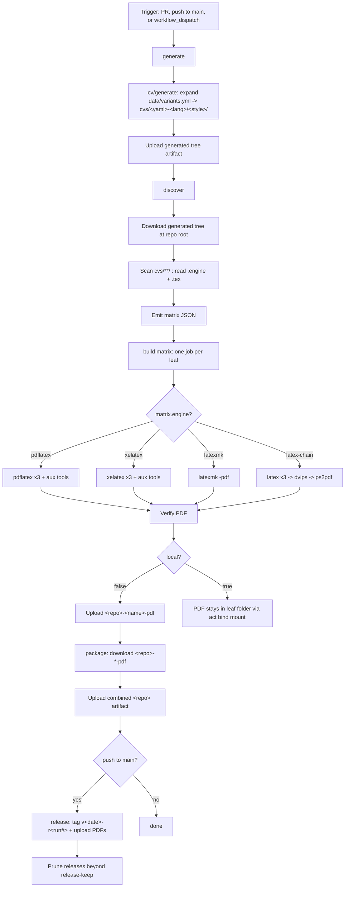

# Curriculum Vitae (LaTeX)

[](https://github.com/stklug84/curriculum-vitae/actions/workflows/build.yml)
[](https://github.com/stklug84/curriculum-vitae/actions/workflows/lint.yml)
[](https://github.com/stklug84/curriculum-vitae/actions/workflows/codeql.yml)
[](https://github.com/stklug84/curriculum-vitae/actions/workflows/dependabot/dependabot-updates)
[](https://www.latex-project.org/)

A multi-variant, **fully data-driven** LaTeX CV repository. A single build
matrix in [`data/variants.yml`](data/variants.yml) declares every
`(source YAML × style × language)` combination to produce. CI expands that
matrix into a tree of variants, then discovers and builds them in parallel
inside a digest-pinned TeX Live container. Any build can be reproduced
locally with a host TeX Live install or by replaying the workflow with
[`nektos/act`](https://github.com/nektos/act) via the GitHub CLI.

Nothing about which style maps to which language or source YAML is
hardcoded anywhere. Add a `{ style, lang }` line to the matrix and the new
variant is generated, discovered and built — no code or workflow change.

## How it fits together

```text
data/variants.yml      (the build matrix: styles × langs × cvs)
data/cv-*.yml          (canonical bilingual CV sources)
templates/<style>.tex.j2  (one Jinja2 main template per style)
        │
        ▼  stklug84/actions/cv/generate  (composite action, run in CI)
cvs/<yaml>-<lang>/<style>/
        ├── sklug-cv.tex        # leaf main, rendered from the template
        ├── .engine             # pdflatex | xelatex (from the style registry)
        ├── personal-info.tex   # cv/parse emitter
        └── cv-*.tex            # cv/parse section bodies
        │
        ▼  latex-build-cv reusable workflow  (discover → build → package → release)
cvs/<yaml>-<lang>/<style>/sklug-cv.pdf
```

- **Sources** (`data/cv-*.yml`) hold the content, bilingual `de`/`en`.
- **Templates** (`templates/<style>.tex.j2`) hold the per-style document
  scaffolding; they `\input` the generated bodies and select the
  language/encoding packages per engine.
- **The matrix** (`data/variants.yml`) wires sources to styles and
  languages. See [`data/README.md`](data/README.md) for the manifest and
  schema in full.
- **Generation** is the
  [`stklug84/actions` `cv/generate`](https://github.com/stklug84/actions)
  composite action; it renders each leaf main from its template and emits
  the section bodies via the `cv/parse` emitter. The repo itself ships no
  generator scripts.

## Source CVs and styles

Two canonical sources live under `data/`. Only `cv-databricks` is in the
committed build matrix; `cv-academics` is a local-only source (its YAML is
gitignored) built on demand via `task cv:academics`:

| Source YAML | Focus | Variants | Built |
| --- | --- | --- | --- |
| `data/cv-databricks.yml` | Industry / Databricks | cv-tagged-ia (en) | Committed matrix (CI + local) |
| `data/cv-academics.yml` | Academic-leaning | cv-plain-style (de) | Local only (`task cv:academics`) |

All six styles below are authored and available in the repo. The committed
matrix currently activates a single one (`cv-tagged-ia`) against the
`cv-databricks` source; the others remain ready to enable by uncommenting
their `styles` registry entries and adding matrix lines.

Styles are declared in `data/variants.yml`'s `styles` registry. Each maps
to a TeX engine and a `cv/parse` body emitter (`plain` or the
style-agnostic `sidebar`). Per US-CV conventions **none of these styles
define a photo box** except the classic plain style.

| Style file | Engine | Layout |
| --- | --- | --- |
| `styles/cv-plain-style.sty` | pdflatex | Classic two-page, photo + signature, longtable layout |
| `styles/cv-banking-fs.sty` | xelatex | Single column, centered header, two-tone red headings, footer |
| `styles/cv-tagged-ia.sty` | xelatex | Single column, black tag headings, skill bars + bubbles, mono tech lists |
| `styles/cv-sidebar-pw.sty` | xelatex | Left sidebar (37/63), grayscale, dark banner, pill chips, 5-dot languages |
| `styles/cv-sidebar-dh.sty` | xelatex | Left sidebar (35/65), green section banners, slate titles |
| `styles/cv-sidebar-vs.sty` | xelatex | Right sidebar (≈57/37), Letter, accent blue + teal rules, donut chart |

The styles all consume the same generated per-section bodies, so a
single source YAML renders into every style unchanged.

## The build matrix

`data/variants.yml` is the single control plane. The committed matrix
currently declares one active `cv-databricks` leaf, with the remaining
styles commented out (ready to re-enable):

| Source | Style | Lang | Leaf directory | Engine | Active |
| --- | --- | --- | --- | --- | --- |
| cv-databricks | cv-tagged-ia | en | `cvs/cv-databricks-en/cv-tagged-ia/` | xelatex | yes |
| cv-databricks | cv-banking-fs | en | `cvs/cv-databricks-en/cv-banking-fs/` | xelatex | commented |
| cv-databricks | cv-sidebar-pw | en | `cvs/cv-databricks-en/cv-sidebar-pw/` | xelatex | commented |
| cv-databricks | cv-sidebar-dh | en | `cvs/cv-databricks-en/cv-sidebar-dh/` | xelatex | commented |
| cv-databricks | cv-sidebar-vs | en | `cvs/cv-databricks-en/cv-sidebar-vs/` | xelatex | commented |

Uncomment a matrix line (and its `styles` registry entry) to build that
style. `cv-academics` is intentionally absent from the committed matrix
(its gitignored source carries PII); it builds locally via
`task cv:academics` into `cvs/cv-academics-de/cv-plain-style/` (pdflatex).
Any registered `{ style, lang }` pairing remains expressible in the matrix.

The leaf main is always `sklug-cv.tex`. The directory scheme is
`cvs/<yaml-without-extension>-<lang>/<style>/`. Languages and their
`babel` / `polyglossia` tokens plus localized `label_*` headings come from
the manifest's `langs` registry, so any `{ style, lang }` pairing — even
ones not currently listed — renders with the correct language packages and
headings.

## Downloading the PDFs

Every merge to `main` publishes the built PDFs as a versioned GitHub
release tagged `v<YYYY.MM.DD>-r<run-number>` (see the
[Releases](https://github.com/stklug84/curriculum-vitae/releases) page).
Release assets never expire; only the 10 newest releases are kept (older
ones are pruned automatically, including their tags).

Grab the current PDFs with the GitHub CLI — without a tag this always
resolves to the latest release (`--pattern` is required in that case):

```sh
gh release download -R stklug84/curriculum-vitae -p '*.pdf'
```

Or a specific revision:

```sh
gh release download v2026.06.23-r19 -R stklug84/curriculum-vitae
```

PR builds additionally upload short-lived workflow artifacts for review
(see [Artifact names](#artifact-names)).

## Repository layout

```text
.
├── data/
│   ├── variants.yml              # Build matrix: styles × langs × cvs
│   ├── cv-academics.yml          # Canonical source (bilingual de/en)
│   ├── cv-databricks.yml         # Canonical source (bilingual de/en)
│   └── README.md                 # Manifest + schema + targets contract
├── templates/
│   ├── cv-plain-style.tex.j2     # Per-style leaf main templates (Jinja2)
│   ├── cv-banking-fs.tex.j2
│   ├── cv-tagged-ia.tex.j2
│   ├── cv-sidebar-pw.tex.j2
│   ├── cv-sidebar-dh.tex.j2
│   └── cv-sidebar-vs.tex.j2
├── styles/
│   ├── cv-plain-style.sty        # Classic two-page CV style (pdflatex)
│   ├── cv-banking-fs.sty         # single column (banking)
│   ├── cv-tagged-ia.sty          # single column (black tags)
│   ├── cv-sidebar-pw.sty         # sidebar (grayscale, no photo)
│   ├── cv-sidebar-dh.sty         # sidebar (green banners, no photo)
│   └── cv-sidebar-vs.sty         # right sidebar (blue, donut)
├── images/                       # Shared assets (photo, signature)
├── cvs/                          # Generated variant tree (gitignored, never committed)
│   └── <yaml>-<lang>/<style>/    # Per leaf: sklug-cv.tex, personal-info.tex,
│                                 #   cv-*.tex bodies, .engine — all from cv/generate
├── .github/
│   ├── CODEOWNERS                # Default reviewer: @stklug84
│   ├── dependabot.yml            # Actions + TeX Live digest updates
│   ├── docker/texlive/Dockerfile # Digest pin for the TeX Live image
│   └── workflows/
│       ├── build.yml             # Thin caller -> latex-build-cv (generate + build)
│       ├── codeql.yml            # CodeQL (actions language)
│       └── lint.yml              # actionlint/yamllint/markdownlint/hadolint/cv-schema
├── .markdownlint.yml             # Markdown lint rules
├── .yamllint.yml                 # YAML lint rules
└── CONTRIBUTING.md               # Conventions and PR checklist
```

Each leaf sits **three** directories below the repo root
(`cvs/<yaml>-<lang>/<style>/`). Shared assets (`images/` and the `*.sty`
files in `styles/`) live at the repo root and are resolved from inside each
leaf via

```text
TEXINPUTS=.:../../..:../../../styles:../../../images:
```

The leading `.` resolves each leaf's own generated `personal-info.tex` and
`cv-*.tex` first. The workflow applies this setting automatically; use the
same value for local builds.

## Editing CV content

Content is **not** edited in the `.tex` files — edit the canonical sources
[`data/cv-academics.yml`](data/cv-academics.yml) and
[`data/cv-databricks.yml`](data/cv-databricks.yml) (bilingual). CI
regenerates the whole `cvs/` tree on every build. See
[`data/README.md`](data/README.md) for the schema and the `targets`
contract. Do not hand-edit the generated `sklug-cv.tex` / `cv-*.tex` /
`personal-info.tex` files; they carry a "do not edit by hand" banner and
are overwritten on regeneration.

To change a variant's **scaffolding** (not its content), edit the matching
`templates/<style>.tex.j2`. To change the **matrix** (which sources render
in which style/language), edit `data/variants.yml`.

## Adding a new CV variant

Because the build is matrix-driven, adding a variant is a one-line change:

1. Open [`data/variants.yml`](data/variants.yml).
2. Under the desired `cvs.<yaml>` (e.g. `cv-academics`), add an entry:

   ```yaml
   - { style: cv-sidebar-pw, lang: de }
   ```

   The `style` must exist in the `styles` registry and the `lang` in the
   `langs` registry. That is the only edit required.
3. Open a pull request (`main` is protected; direct pushes are rejected).
   CI regenerates the tree, discovers the new leaf
   (`cvs/<yaml>-<lang>/<style>/`), builds it, and uploads its PDF artifact
   for review. After merge it is included in the next versioned release.

To add a **new style**: author `styles/<style>.sty` and
`templates/<style>.tex.j2`, add a `styles.<style>` entry (engine +
`parse_style`), then reference it from the matrix. To add a **new
language**: add a `langs.<lang>` block (babel/polyglossia tokens +
`label_*` headings), then reference it.

## Building locally

### Direct (host TeX Live)

`cd` into a leaf directory and invoke the engine from its `.engine` file.
The `TEXINPUTS` setting lets the leaf main resolve its generated bodies,
the shared `*.sty` files, and `images/` from the repo root.

```sh
# Classic two-page CV (pdflatex)
cd cvs/cv-academics-de/cv-plain-style
TEXINPUTS=.:../../..:../../../styles:../../../images: pdflatex -interaction=nonstopmode -halt-on-error sklug-cv.tex

# A sidebar variant (xelatex)
cd cvs/cv-academics-en/cv-sidebar-pw
TEXINPUTS=.:../../..:../../../styles:../../../images: xelatex -interaction=nonstopmode -halt-on-error sklug-cv.tex
```

`latexmk` users can equivalently run:

```sh
cd cvs/<yaml>-<lang>/<style>
TEXINPUTS=.:../../..:../../../styles:../../../images: latexmk -pdf -interaction=nonstopmode -halt-on-error -g sklug-cv.tex
```

The PDF lands next to the source: `cvs/<yaml>-<lang>/<style>/sklug-cv.pdf`.

The `cvs/` tree is generated, not committed (it is gitignored). Run
`cv/generate` from the `data/*.yml` sources first to produce it locally;
CI regenerates the same tree on every build.

### Via the CI workflow with `gh act`

This replays the exact CI logic on your machine inside the digest-pinned
TeX Live container, so you do not need TeX Live installed on the host.
`act` fetches the remote reusable workflow and the composite actions (all
repositories are public — network access required, no token) and builds
the **full matrix** — every CV variant in one run, regenerating the tree
first.

```sh
gh act workflow_dispatch -W .github/workflows/build.yml \
  --input local=true \
  -P ubuntu-latest=catthehacker/ubuntu:act-latest
```

Two flags matter (verified with act 0.2.89):

- `-P ubuntu-latest=catthehacker/ubuntu:act-latest` — act's default micro
  image (`node:16-buster-slim`) lacks `jq`, which the `discover` job needs;
  the medium runner image matches GitHub's toolset.
- On Apple Silicon add `--container-architecture linux/arm64` if the TeX
  Live image was previously pulled as arm64 — act defaults to amd64 and the
  Docker daemon refuses a digest whose local platform differs.

`act` exports `ACT=true` automatically, so the workflow also auto-detects
local mode even if you omit `--input local=true`. In local mode the PDFs
land in their leaf folders via the bind mount; the upload, package, and
release jobs are skipped.

### Via `go-task` (recommended wrapper)

A [`Taskfile.yml`](Taskfile.yml) wraps the `gh act` invocations above
(including the Apple-Silicon `--container-architecture` flag, applied
automatically on `darwin/arm64`). Requires
[go-task](https://taskfile.dev) and the
[`gh-act`](https://github.com/nektos/gh-act) extension.

```sh
task                 # list available tasks
task build           # build the full committed matrix (data/variants.yml)
task cv:databricks   # build language en across all non-plain styles
task cv:academics    # build the local-only, PII-bearing cv-academics variant
task lint            # run the lint workflow locally
task clean           # remove the overlay and the generated cvs/ tree
```

There are three build targets:

- **`task build`** runs the workflow against the committed
  `data/variants.yml` unchanged — the generic, manifest-driven matrix
  build (whatever the committed matrix currently declares). This is the
  CI-equivalent local build; no overlay is involved.
- **`task cv:databricks`** builds language `en` across **all non-plain
  styles**. Its matrix is derived dynamically from the `styles` registry
  in `data/variants.yml` (every style except `cv-plain-style`), emitted as
  `{style, lang: en}` leaves into a gitignored overlay
  (`data/variants.local.yml`). Adding a new non-plain style to the
  registry extends this build with no edit to the Taskfile.
- **`task cv:academics`** builds the single `cv-plain-style` + language
  `de` variant from the PII-bearing source `data/cv-academics.yml`.

Both `cv:*` targets generate the overlay deterministically: they copy the
`styles`/`langs` registries from `data/variants.yml`, then append their own
`cvs:` block, and run `gh act` with
`--input generate-manifest=data/variants.local.yml`. The overlay is removed
when the task finishes (success, failure, or interrupt), so no PII-bearing
file ever enters the git index.

The committed build matrix (`data/variants.yml`) deliberately excludes
`cv-academics`: its source `data/cv-academics.yml` carries critical PII
(date and place of birth, home address, signature) and is **gitignored**,
so it never reaches the remote — hence it is built only locally via
`task cv:academics`. By contrast `data/cv-databricks.yml` carries only
professional contact details and is committed normally.

## CI workflow explained

CI turns every CV variant into a PDF on every pull request, on every push
to `main` (publishing a versioned release), and on demand via the Actions
UI. It is intentionally generic: it regenerates the variant tree from the
matrix, auto-discovers what to build, picks the right engine per variant
from each `.engine` dotfile, and runs the legs in parallel.

The logic is layered across three repositories:

| Layer | Where | Role |
| --- | --- | --- |
| Caller `build.yml` | this repo | Triggers, concurrency, permissions, repo-specific inputs — a single `uses:` block |
| Reusable workflow `latex-build-cv.yml` | [`stklug84/github-workflows`](https://github.com/stklug84/github-workflows) (SHA-pinned) | Jobs: `generate` → `discover` → `build` (matrix) → `package` → `release` |
| Composite action `cv/generate` | [`stklug84/actions`](https://github.com/stklug84/actions) (`v2`) | Expands `data/variants.yml` into the variant tree (templates + `cv/parse`) |
| Composite action `cv/parse` | [`stklug84/actions`](https://github.com/stklug84/actions) (`v2`) | Emits the per-section `.tex` bodies + `personal-info.tex` from a source YAML |
| Composite actions `texlive/*` | [`stklug84/actions`](https://github.com/stklug84/actions) (SHA-pinned) | Behavior: `discover-variants`, `build-pdf`, `upload-build-logs` |

All generation and build logic lives in the reusable workflow and the
composite actions. The caller in this repo is **pure configuration** — one
job, one `uses:`:

```yaml
jobs:
  build:
    permissions:
      contents: write          # consumed only by the release job
    uses: stklug84/github-workflows/.github/workflows/latex-build-cv.yml@<sha>  # v1.9.6
    with:
      generate: "true"          # render the variant tree from the matrix first
      generate-manifest: ${{ inputs.generate-manifest || 'data/variants.yml' }}
      texinputs: ".:../../..:../../../styles:../../../images:"
      local: ${{ inputs.local }}
      release: "true"           # versioned release on pushes to main
      release-keep: "10"
```

With `generate: 'true'`, the reusable workflow's `generate` job checks out
this repo, runs `cv/generate` (manifest `data/variants.yml`, templates
`templates/`, sources `data/`), and hands the resulting tree to discovery
and the build internally. The caller needs **no** generate job of its own.

### Triggers

```yaml
on:
  pull_request:
  push:
    branches:
      - main
  workflow_dispatch:
    inputs:
      local:
        description: "Set to 'true' when running locally via gh act"
        required: false
        default: "false"
        type: string
```

- `pull_request` — builds every CV for every PR so reviewers can download
  the rendered PDFs as artifacts before merging.
- `push` to `main` — builds every CV and publishes the PDFs as a versioned
  GitHub release (see [Downloading the PDFs](#downloading-the-pdfs)).
- `workflow_dispatch` — manual build. Inputs: `local` (used by `gh act` to
  skip artifact upload steps) and `generate-manifest` (the build-matrix
  manifest, default `data/variants.yml`; overridden by `task cv:academics`
  and `task cv:databricks` to point at the gitignored
  `data/variants.local.yml` overlay).

### Inputs and environment

Inputs this repo passes to the reusable workflow:

| Name | Value here | Purpose |
| --- | --- | --- |
| `generate` | `"true"` | Run the built-in generate job (expand the matrix into the variant tree) before discovery |
| `generate-manifest` | `${{ inputs.generate-manifest \|\| 'data/variants.yml' }}` | Build-matrix manifest fed to the generate job; the `workflow_dispatch` input lets a local `gh act` run swap in a gitignored overlay |
| `texinputs` | `.:../../..:../../../styles:../../../images:` | Lets each leaf `sklug-cv.tex` resolve shared assets at the repo root (three levels up) |
| `local` | `workflow_dispatch` input (default `"false"`) | Forces local mode for `gh act` (skips upload/package/release) |
| `release` | `"true"` | Publish a versioned release on pushes to `main` |
| `release-keep` | `"10"` | Keep only the 10 newest releases (older ones pruned, tags included) |

Reusable-workflow inputs left at their defaults:

| Name | Default | Purpose |
| --- | --- | --- |
| `root` | `cvs` | Directory scanned for variants (and written by generate) |
| `generate-manifest` | `data/variants.yml` | Build matrix consumed by the generate job |
| `generate-templates-dir` | `templates` | Per-style Jinja2 main templates |
| `generate-data-dir` | `data` | Directory holding the source YAMLs |
| `generate-main-name` | `sklug-cv` | Basename for every generated leaf main |
| `default-engine` | `latexmk` | Engine for variants without an `.engine` file |
| `texlive-dockerfile` | `.github/docker/texlive/Dockerfile` | Path to the TeX Live digest pin in this repo |
| `runs-on` | `ubuntu-latest` | Runner label for all jobs |

Environment resolved inside the reusable workflow:

| Name | Source | Purpose |
| --- | --- | --- |
| `ARTIFACT_PREFIX` | `${{ github.event.repository.name }}` | Dynamic artifact-name prefix; never hardcoded |
| `ACT` | runner env (set by `nektos/act`) | Auto-detected to switch into local mode |

The engine is **not** a workflow input. It is declared per variant via the
`styles.<style>.engine` registry entry, written into each leaf's `.engine`
dotfile by `cv/generate`, and picked up automatically by `discover`.

### Permissions, timeout, concurrency

```yaml
# Caller (this repo)
permissions:
  contents: read          # workflow default
jobs:
  build:
    permissions:
      contents: write     # consumed only by the release job

concurrency:
  group: build-${{ github.workflow }}-${{ github.ref }}
  cancel-in-progress: true
```

- **Two-level permissions** — the caller's workflow default is
  `contents: read`; only the calling job grants `contents: write`, which
  the reusable workflow's `release` job needs to create releases and tags.
  All other jobs read the repo and upload artifacts.
- `concurrency` — pushing several commits to the same PR cancels in-flight
  builds for older commits, saving runner minutes.
- `timeout-minutes: 15` per matrix leg (set in the reusable workflow) —
  guards against a runaway LaTeX loop.
- `container` — every build step runs inside the official TeX Live image
  (digest-pinned via `.github/docker/texlive/Dockerfile`, resolved by the
  `discover` job), so `latexmk`, `pdflatex`, `xelatex`, `latex`, `dvips`,
  `ps2pdf`, `biber`, `bibtex`, `makeindex` and `makeglossaries` are all
  available without installation.

### Workflow diagram



### Step-by-step walkthrough

All jobs live in the reusable workflow; the heavy lifting is delegated to
composite actions from the central
[`stklug84/actions`](https://github.com/stklug84/actions) repository.

**1. `generate`** (opt-in, `generate: 'true'`) — checks out this repo and
runs `cv/generate`, which reads `data/variants.yml`, renders each leaf's
`sklug-cv.tex` from `templates/<style>.tex.j2`, writes the `.engine`
dotfile from the style registry, and emits the section bodies via the
`cv/parse` emitter. The whole `cvs/` tree is uploaded as an internal
artifact.

```yaml
- uses: stklug84/actions/cv/generate@v2
  with:
    manifest: data/variants.yml
    templates-dir: templates
    cvs-root: cvs
    data-dir: data
```

**2. `discover`** — downloads the generated tree at the repo root, then
`texlive/discover-variants` recursively scans `cvs/**/`, locates exactly
one `*.tex` with `\documentclass` per leaf, reads the sibling `.engine`
dotfile (default `latexmk` if absent), and detects per-main auxiliary
toolchain requirements (`bibtex`, `biblatex`, `makeindex`, `glossaries`,
`psfrag`). The result is a JSON matrix consumed by `build`. Each leaf's
matrix `name` is its path relative to `root` with `/` replaced by `-`
(e.g. `cv-academics-en-cv-sidebar-pw`), keeping artifact names unique.

**3. `build` (matrix)** — one leg per variant via
`strategy.matrix: fromJson(...)` with `fail-fast: false`. Each leg
downloads the generated tree, runs in the digest-pinned TeX Live
container, and calls `texlive/build-pdf`, which dispatches on
`matrix.engine`, runs aux tools only when `matrix.has_*` flags say so, and
verifies the PDF.

**4. `package`** — after all matrix legs succeed, downloads every
`${{ env.ARTIFACT_PREFIX }}-*-pdf` artifact and republishes them as a
single combined `${{ env.ARTIFACT_PREFIX }}` artifact.

**5. `release`** — opt-in (`release: "true"`), push events only. Downloads
the per-CV artifacts, flattens them, and publishes a GitHub release tagged
`v<YYYY.MM.DD>-r<run-number>` via the `gh` CLI. When `release-keep` is
non-zero, older releases matching the workflow's tag pattern are deleted
together with their tags; manually created releases are never touched.

### Artifact names

All artifact names are derived from `${{ github.event.repository.name }}`
(the workflow-level `ARTIFACT_PREFIX`) and the per-leaf variant name. No
artifact name is hardcoded; adding a matrix entry automatically yields a
corresponding artifact.

| Artifact | Pattern | Example (this repo, `curriculum-vitae`) |
| --- | --- | --- |
| Per-CV PDF | `<repo>-<name>-pdf` | `curriculum-vitae-cv-academics-en-cv-sidebar-pw-pdf` |
| Per-CV logs (failure) | `<repo>-<name>-logs` | `curriculum-vitae-cv-academics-de-cv-plain-style-logs` |
| Combined | `<repo>` | `curriculum-vitae` |

### Engine selection guide

The engine is set per style via `styles.<style>.engine` in the manifest
(written to each leaf's `.engine`). Valid values:

| Engine value | When to use | Why |
| --- | --- | --- |
| `latexmk` | Default for variants without an `.engine` file | Auto-runs the right passes plus `biber` / `bibtex` / `makeindex` / `makeglossaries` |
| `pdflatex` | Classic pdfLaTeX (plain style) | Loads `babel` via the `\documentclass` language option |
| `xelatex` | OpenType-font styles (`fontspec` + `polyglossia`) | Required by every sidebar/example style |
| `latex-chain` | Documents using `psfrag` | `psfrag` substitutions are applied by `dvips` at the PostScript stage |

If you select `pdflatex` or `xelatex` but the document `\usepackage{psfrag}`s
anything, the workflow fails fast with a clear remediation hint instead of
producing a PDF with un-substituted markers.

### Where the PDF lands

| Run mode | Location |
| --- | --- |
| GitHub Actions (PR or `workflow_dispatch`) | Workflow artifacts `<repo>-<name>-pdf` per variant, plus combined `<repo>` |
| GitHub Actions (push to `main`) | Same artifacts, plus a versioned release `v<date>-r<run#>` with all PDFs |
| `gh act` (local) | `cvs/<yaml>-<lang>/<style>/sklug-cv.pdf` in your working tree (via bind mount) |

## Known caveats and future improvements

- **Container pinning**: the TeX Live image is pinned by digest in
  `.github/docker/texlive/Dockerfile` (single source of truth; the workflow
  reads its `FROM` line). Dependabot's docker ecosystem bumps the digest as
  upstream `texlive/texlive:latest` moves. Dependabot has no CTAN / TeX Live
  package ecosystem, so individual LaTeX packages are not tracked — the
  container digest is the LaTeX-toolchain version pin.
- **Central pins need manual bumps**: the reusable workflow
  (`latex-build-cv.yml`) and the composite actions it uses are SHA-pinned.
  Dependabot bumps the reusable-workflow pin in this repo; the composite
  action pins live inside `stklug84/github-workflows` and are bumped there.
  New central releases (including `cv/generate` and the recursive
  `discover-variants`) only take effect here after the pins are updated.
- **Role line and summary are blank**: the leaf main templates declare
  empty `\providecommand` fallbacks for the role line and profile summary
  so every document compiles, but the `cv/parse` emitter does not yet emit
  those macros. Populating them from `meta.title` / `meta.summary` is a
  pending `cv/parse` enhancement; until it ships, those two lines render
  blank. See [`data/README.md`](data/README.md).
- **Release retention**: only the 10 newest releases are kept
  (`release-keep: "10"`). Pruned releases are deleted **including their
  PDFs and tags** — older CV revisions are gone for good.
- **`gh act` needs the medium runner image**: the default micro image lacks
  `jq` (used by `discover`), so pass
  `-P ubuntu-latest=catthehacker/ubuntu:act-latest`; on Apple Silicon a
  consistent `--container-architecture` may also be required (see
  [Building locally](#via-the-ci-workflow-with-gh-act)).
- **One main per leaf**: `discover` enforces exactly one `*.tex` with
  `\documentclass` per leaf directory. The generator always writes exactly
  one (`sklug-cv.tex`) per leaf.
