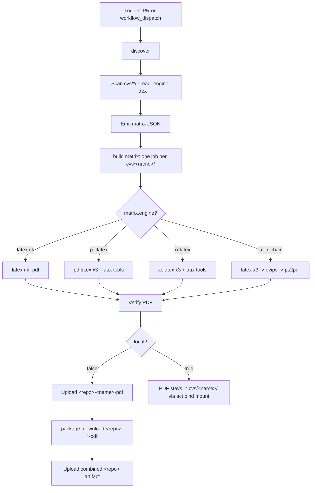

# Curriculum Vitae (LaTeX)

[](https://github.com/stklug84/curriculum-vitae/actions/workflows/build.yml)
[](https://github.com/stklug84/curriculum-vitae/actions/workflows/lint.yml)
[](https://github.com/stklug84/curriculum-vitae/actions/workflows/codeql.yml)
[](https://github.com/stklug84/curriculum-vitae/actions/workflows/dependabot/dependabot-updates)
[](https://www.latex-project.org/)

A multi-variant LaTeX CV repository. Every directory under `cvs/<name>/`
contains exactly one CV main document plus a hidden `.engine` file that
declares the LaTeX engine to use. CI auto-discovers every variant and builds
them in parallel inside a TeX Live container. Any build can be reproduced
locally with the host TeX Live install or by replaying the workflow with
[`nektos/act`](https://github.com/nektos/act) via the GitHub CLI.

Today the repo ships two variants:

| Variant            | Folder             | Engine   | Style file                  |
| ------------------ | ------------------ | -------- | --------------------------- |
| Classic two-page   | `cvs/photo-2page/` | pdflatex | `styles/cv-plain-style.sty` |
| Sidebar two-column | `cvs/sidebar/`     | xelatex  | `styles/cv-sidebar.sty`     |

## Downloading the PDFs

Every merge to `main` publishes the built PDFs as a versioned GitHub
release tagged `v<YYYY.MM.DD>-r<run-number>` (see the
[Releases](https://github.com/stklug84/curriculum-vitae/releases) page).
Release assets never expire; only the 10 newest releases are kept
(older ones are pruned automatically, including their tags).

Grab the current PDFs with the GitHub CLI — without a tag this always
resolves to the latest release (`--pattern` is required in that case):

```sh
gh release download -R stklug84/curriculum-vitae -p '*.pdf'
```

Or a specific revision:

```sh
gh release download v2026.06.12-r17 -R stklug84/curriculum-vitae
```

PR builds additionally upload short-lived workflow artifacts for review
(see [Artifact names](#artifact-names)).

## Repository layout

```text
.
├── styles/
│   ├── cv-plain-style.sty        # Classic two-page CV style (pdflatex)
│   └── cv-sidebar.sty            # Sidebar CV style (xelatex, FiraSans)
├── personal-info.tex             # Shared name / contact / asset paths
├── images/                       # Shared assets (photo, signature)
├── cvs/
│   ├── photo-2page/
│   │   ├── lebenslauf-photo-2page.tex
│   │   └── .engine               # contents: pdflatex
│   └── sidebar/
│       ├── lebenslauf-sidebar.tex
│       └── .engine               # contents: xelatex
└── .github/workflows/build.yml
```

Shared assets (`personal-info.tex`, `images/`, and the `*.sty` files in
`styles/`) live at the repo root and are resolved from inside each variant
directory via `TEXINPUTS=.:../..:../../styles:../../images:`. That setting is
applied automatically by the workflow and is the only thing you need locally
as well.

## Adding a new CV variant

The workflow is fully data-driven — there is no list of variants to update.
To add a third CV:

1. `mkdir cvs/<name>`
2. Drop exactly one `*.tex` file with `\documentclass{...}` into it. Reference
   shared assets normally (`\input{personal-info}`, `\usepackage{cv-sidebar}`,
   `\includegraphics{images/photo.jpg}`).
3. `echo <engine> > cvs/<name>/.engine` — one of `latexmk`, `pdflatex`,
   `xelatex`, `latex-chain`. If `.engine` is missing, `latexmk` is used.
4. Commit and push. CI picks the new variant up automatically and uploads
   `<repo>-<name>-pdf` as a workflow artifact.

## Building locally

### Direct (host TeX Live)

`cd` into the variant directory and invoke the engine matching its `.engine`
file. The `TEXINPUTS` setting lets the main `.tex` resolve `personal-info.tex`,
the shared `*.sty` files, and `images/` from the repo root.

```sh
# Classic two-page CV (pdflatex)
cd cvs/photo-2page
TEXINPUTS=.:../..:../../styles:../../images: pdflatex -interaction=nonstopmode -halt-on-error lebenslauf-photo-2page.tex

# Sidebar variant (xelatex)
cd cvs/sidebar
TEXINPUTS=.:../..:../../styles:../../images: xelatex -interaction=nonstopmode -halt-on-error lebenslauf-sidebar.tex
```

`latexmk` users can equivalently run:

```sh
cd cvs/<variant>
TEXINPUTS=.:../..:../../styles:../../images: latexmk -pdf -interaction=nonstopmode -halt-on-error -g <main>.tex
```

The PDF lands next to the source: `cvs/<variant>/<main>.pdf`.

### Via the CI workflow with `gh act`

This replays the exact CI logic on your machine inside the digest-pinned
TeX Live container, so you do not need TeX Live installed on the host.
`act` builds the **full matrix** — every CV variant in one run.

```sh
gh act workflow_dispatch -W .github/workflows/build.yml --input local=true
```

`act` exports `ACT=true` automatically, so the workflow also auto-detects
local mode even if you omit `--input local=true`. In local mode the PDFs land
in their variant folders via the bind mount; no separate upload or `./out/`
copy step is needed.

## CI workflow explained

The `.github/workflows/build.yml` workflow turns every CV variant under
`cvs/*/` into a PDF on every pull request, on every push to `main`
(publishing a versioned release), and on demand via the Actions UI.
It is intentionally generic: it auto-discovers what to build, picks the
right engine per variant from each `.engine` dotfile, and runs the legs in
parallel.

### Triggers

```yaml
on:
  pull_request:
  push:
    branches:
      - main
  workflow_dispatch:
    inputs:
      local:
        description: "Set to 'true' when running locally via gh act"
        required: false
        default: "false"
        type: string
```

- `pull_request` — builds every CV for every PR so reviewers can download
  the rendered PDFs as artifacts before merging.
- `push` to `main` — builds every CV and publishes the PDFs as a
  versioned GitHub release (see
  [Downloading the PDFs](#downloading-the-pdfs)).
- `workflow_dispatch` — lets you trigger a manual build. The only input is
  `local`, used by `gh act` to skip artifact upload steps.

### Inputs and environment

| Name | Source | Default | Purpose |
| --- | --- | --- | --- |
| `local` | `workflow_dispatch` input | `"false"` | Forces local mode for `gh act` (skips artifact upload) |
| `ARTIFACT_PREFIX` | workflow `env` | `${{ github.event.repository.name }}` | Dynamic artifact-name prefix; never hardcoded |
| `TEXINPUTS` | `texinputs` input of `texlive/build-pdf` | `.:../..:../../styles:../../images:` | Lets each `cvs/<name>/<main>.tex` resolve shared assets at the repo root |
| `ACT` | runner env (set by `nektos/act`) | unset | Auto-detected to switch into local mode |

The engine is **not** a workflow input. It is declared per variant via the
`.engine` dotfile and picked up automatically by `discover`.

### Permissions, timeout, concurrency

```yaml
permissions:
  contents: read

concurrency:
  group: build-${{ github.workflow }}-${{ github.ref }}
  cancel-in-progress: true

jobs:
  build:
    runs-on: ubuntu-latest
    timeout-minutes: 15
    container:
      image: ${{ needs.discover.outputs.texlive-image }}
```

- `permissions: contents: read` — the build only needs to read the repo and
  upload artifacts, so the `GITHUB_TOKEN` is scoped to the minimum required.
- `concurrency` — if you push several commits to the same PR in quick
  succession, in-flight builds for older commits are cancelled, saving
  runner minutes.
- `timeout-minutes: 15` per matrix leg — guards against a runaway LaTeX
  loop or a broken package burning a full hour of runner time.
- `container` — every build step runs inside the official TeX Live image
  (digest-pinned via `.github/docker/texlive/Dockerfile`, resolved by the
  `discover` job), so `latexmk`, `pdflatex`, `xelatex`, `latex`, `dvips`,
  `ps2pdf`, `biber`, `bibtex`, `makeindex` and `makeglossaries` are all
  available without installation.

### Workflow diagram



### Step-by-step walkthrough

The heavy lifting is delegated to composite actions from the central
[`stklug84/actions`](https://github.com/stklug84/actions) repository
(SHA-pinned, kept current by Dependabot): `texlive/discover-variants`,
`texlive/build-pdf`, and `texlive/upload-build-logs`. This workflow is
pure orchestration — the matrix entry is data, the actions are behavior.

**1. `discover`** — `texlive/discover-variants` scans every directory
under `cvs/`, locates exactly one `*.tex` with `\documentclass` per
folder, reads the sibling `.engine` dotfile (default `latexmk` if
absent), and detects per-main auxiliary toolchain requirements
(`bibtex`, `biblatex`, `makeindex`, `glossaries`, `psfrag`). The result
is emitted as a JSON matrix consumed by `build`.

```yaml
- name: Discover CV variants
  id: scan
  uses: stklug84/actions/texlive/discover-variants@<sha>  # v1.3.0
  with:
    root: cvs
    default-engine: latexmk
```

**2. `build` (matrix)** — one leg per variant via
`strategy.matrix: fromJson(...)` with
`fail-fast: false`. Each leg runs in the digest-pinned TeX Live container
and calls `texlive/build-pdf`, which dispatches on `matrix.engine`
(`latexmk` / `pdflatex` / `xelatex` / `latex-chain`), runs aux tools only
when `matrix.has_*` flags say they are needed, and verifies the PDF.

```yaml
build:
  needs: discover
  strategy:
    fail-fast: false
    matrix: ${{ fromJson(needs.discover.outputs.matrix) }}
  container:
    image: ${{ needs.discover.outputs.texlive-image }}
  steps:
    - uses: actions/checkout@v6
    - name: Build ${{ matrix.name }} (${{ matrix.engine }})
      uses: stklug84/actions/texlive/build-pdf@<sha>  # v1.3.0
      with:
        working-directory: ${{ matrix.dir }}
        main: ${{ matrix.main }}
        engine: ${{ matrix.engine }}
        texinputs: ".:../..:../../styles:../../images:"
        # ... has-* flags from the matrix ...
    - name: Upload PDF artifact
      if: needs.discover.outputs.local != 'true'
      uses: actions/upload-artifact@v7
      with:
        name: ${{ env.ARTIFACT_PREFIX }}-${{ matrix.name }}-pdf
        path: ${{ matrix.dir }}/${{ matrix.main }}.pdf
```

**3. `package`** — runs after all matrix legs succeed and downloads every
`${{ env.ARTIFACT_PREFIX }}-*-pdf` artifact, then republishes them as a
single combined `${{ env.ARTIFACT_PREFIX }}` artifact with each PDF in its
own subdirectory.

```yaml
package:
  needs: [discover, build]
  if: needs.discover.outputs.local != 'true'
  steps:
    - uses: actions/download-artifact@v6
      with:
        pattern: ${{ env.ARTIFACT_PREFIX }}-*-pdf
        path: ./dist
    - uses: actions/upload-artifact@v7
      with:
        name: ${{ env.ARTIFACT_PREFIX }}
        path: ./dist/*
```

### Artifact names

All artifact names are derived from `${{ github.event.repository.name }}`
(the workflow-level `ARTIFACT_PREFIX`) and the per-folder variant name. No
artifact name is hardcoded; adding a new `cvs/<X>/` folder automatically
yields a corresponding artifact.

| Artifact | Pattern | Example (this repo, `curriculum-vitae`) |
| --- | --- | --- |
| Per-CV PDF | `<repo>-<name>-pdf` | `curriculum-vitae-photo-2page-pdf`, `curriculum-vitae-sidebar-pdf` |
| Per-CV logs (failure) | `<repo>-<name>-logs` | `curriculum-vitae-photo-2page-logs` |
| Combined | `<repo>` | `curriculum-vitae` |

### Engine selection guide

Set the engine per variant by writing one of the following keywords into
`cvs/<name>/.engine`:

| Engine value | When to use | Why |
| --- | --- | --- |
| `latexmk` | Default for most CVs | Auto-runs the right number of passes plus `biber` / `bibtex` / `makeindex` / `makeglossaries` |
| `pdflatex` | Classic pdfLaTeX three-pass build | Lower-level; useful for debugging pass-by-pass |
| `xelatex` | Documents using OpenType fonts (e.g. Fira Sans via `fontspec`) | Required by `cv-sidebar.sty` and any `fontspec`-based style |
| `latex-chain` | Documents using `psfrag` | `psfrag` substitutions are applied by `dvips` at the PostScript stage; `pdflatex` / `xelatex` skip them |

If you select `pdflatex` or `xelatex` but the document `\usepackage{psfrag}`s
anything, the workflow fails fast with a clear remediation hint instead of
producing a PDF with un-substituted markers.

### Where the PDF lands

| Run mode | Location |
| --- | --- |
| GitHub Actions (PR or `workflow_dispatch`) | Workflow artifacts `<repo>-<name>-pdf` per variant, plus combined `<repo>` |
| GitHub Actions (push to `main`) | Same artifacts, plus a versioned release `v<date>-r<run#>` with all PDFs |
| `gh act` (local) | `cvs/<name>/<main>.pdf` in your working tree (via bind mount) |

## Known caveats and future improvements

- **Container pinning**: the TeX Live image is pinned by digest in
  `.github/docker/texlive/Dockerfile` (single source of truth; the workflow
  reads its `FROM` line). Dependabot's docker ecosystem bumps the digest as
  upstream `texlive/texlive:latest` moves. Dependabot has no CTAN / TeX Live
  package ecosystem, so individual LaTeX packages are not tracked — the
  container digest is the LaTeX-toolchain version pin.
- **Action pinning**: `actions/checkout@v6`, `actions/upload-artifact@v7`,
  and `actions/download-artifact@v6` are pinned by major version. Pin to a
  commit SHA for stricter supply-chain hardening.
- **No `push` trigger**: by design, CI runs only on PRs and manual dispatch;
  there is no automatic build of the default branch.
- **No `tlmgr` cache**: the workflow does not install extra TeX packages, so
  no caching is needed today. Add an `actions/cache` step if package
  installation is introduced later.
- **One main per folder**: `discover` enforces exactly one `*.tex` with
  `\documentclass` per `cvs/<name>/`. Use one folder per CV variant.
