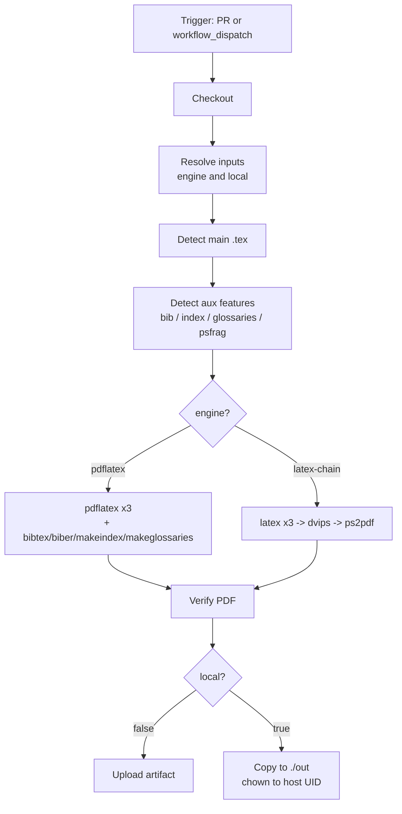

# Curriculum Vitae (LaTeX)

A two-page LaTeX CV built from `Lebenslauf-Photo-2Page.tex`. The document is
compiled in CI with a TeX Live container and can be reproduced locally either
with a direct `pdflatex` invocation or by running the same GitHub Actions
workflow under [`nektos/act`](https://github.com/nektos/act) via the GitHub CLI.

## Repository layout

| Path | Purpose |
| --- | --- |
| `Lebenslauf-Photo-2Page.tex` | Main LaTeX source for the CV |
| `images/` | Photo and figures referenced by the document |
| `.github/workflows/build.yml` | CI pipeline that builds the PDF |
| `out/` | Output directory produced by local `act` runs (gitignored) |
| `.gitignore` | Ignores LaTeX aux files, root PDFs and `out/` |

## Building locally

### Direct (host TeX Live)

```sh
pdflatex -interaction=nonstopmode -halt-on-error Lebenslauf-Photo-2Page.tex
```

### Via the CI workflow with `gh act`

This replays the exact CI logic on your machine inside the
`texlive/texlive:latest` container, so you do not need TeX Live installed on the
host:

```sh
gh act workflow_dispatch \
  -W .github/workflows/build.yml \
  --input engine=pdflatex \
  --input local=true
```

`act` exports `ACT=true` automatically, so the workflow also auto-detects local
mode even if you omit `--input local=true`. The resulting PDF is written to
`./out/Lebenslauf-Photo-2Page.pdf` and is chowned back to your host user.

## CI workflow explained

The `.github/workflows/build.yml` workflow turns the `.tex` source into a PDF
on every pull request and on demand via the Actions UI. It is intentionally
generic: rather than hardcoding the document name or the build steps, it
detects what the source needs and chooses the appropriate toolchain.

### Triggers

```yaml
on:
  pull_request:
  workflow_dispatch:
    inputs:
      engine:
        description: "LaTeX toolchain to use"
        required: true
        default: "pdflatex"
        type: choice
        options:
          - pdflatex
          - latex-chain
      local:
        description: "Set to 'true' when running locally via gh act ..."
        required: false
        default: "false"
        type: string
```

- `pull_request` — builds the CV for every PR so reviewers can download the
  rendered PDF as an artifact before merging.
- `workflow_dispatch` — lets you trigger a manual build with two inputs
  (`engine` and `local`).

There is intentionally no `push` trigger; the workflow only runs on PRs and
manual dispatch.

### Inputs and environment

| Name | Source | Default | Purpose |
| --- | --- | --- | --- |
| `engine` | `workflow_dispatch` input | `pdflatex` | Picks `pdflatex` or `latex-chain` (`latex` → `dvips` → `ps2pdf`) |
| `local` | `workflow_dispatch` input | `"false"` | Forces local mode for `gh act` |
| `DEFAULT_ENGINE` | workflow `env` | `pdflatex` | Engine used when no input is provided |
| `MAIN_TEX` | workflow `env` | `""` | Optional override for the main document basename; auto-detected when empty |
| `ACT` | runner env (set by `nektos/act`) | unset | Auto-detected to switch into local mode |

### Permissions, timeout, concurrency

```yaml
permissions:
  contents: read

concurrency:
  group: build-${{ github.workflow }}-${{ github.ref }}
  cancel-in-progress: true

jobs:
  build:
    runs-on: ubuntu-latest
    timeout-minutes: 15
    container:
      image: texlive/texlive:latest
```

- `permissions: contents: read` — the build only needs to read the repo and
  upload artifacts, so the `GITHUB_TOKEN` is scoped to the minimum required.
- `concurrency` — if you push several commits to the same PR in quick
  succession, in-flight builds for older commits are cancelled, saving runner
  minutes.
- `timeout-minutes: 15` — guards against a runaway LaTeX loop or a broken
  package burning a full hour of runner time.
- `container: texlive/texlive:latest` — runs every step inside the official
  TeX Live image so `pdflatex`, `latex`, `dvips`, `ps2pdf`, `biber`,
  `bibtex`, `makeindex` and `makeglossaries` are all available without
  installation.

### Workflow diagram



### Step-by-step walkthrough

**1. Checkout** — pulls the repository into the runner.

```yaml
- name: Checkout
  uses: actions/checkout@v6
```

**2. Resolve inputs** — picks the active `engine` and `local` flag from the
`workflow_dispatch` inputs, falling back to `DEFAULT_ENGINE` and the `ACT`
environment variable. The values are exposed as step outputs so every later
step can branch on them.

```yaml
- name: Resolve inputs
  id: cfg
  env:
    ENGINE_IN: ${{ inputs.engine }}
    LOCAL_IN: ${{ inputs.local }}
  run: |
    set -euo pipefail
    ENGINE="${ENGINE_IN:-$DEFAULT_ENGINE}"
    LOCAL="${LOCAL_IN:-${ACT:+true}}"
    LOCAL="${LOCAL:-false}"
    echo "engine=$ENGINE" >> "$GITHUB_OUTPUT"
    echo "local=$LOCAL"   >> "$GITHUB_OUTPUT"
```

**3. Detect main LaTeX document** — if `MAIN_TEX` is set in `env`, that
basename wins. Otherwise the step greps every `*.tex` file in the repo root
for `\documentclass` and uses the first match. This keeps the workflow
portable across CV variants.

```yaml
- name: Detect main LaTeX document
  id: detect_main
  run: |
    set -euo pipefail
    MAIN="${MAIN_TEX:-}"
    if [ -z "$MAIN" ]; then
      MAIN_FILE="$(grep -l '^\s*\\documentclass' ./*.tex 2>/dev/null | head -n1 || true)"
      if [ -z "$MAIN_FILE" ]; then
        echo "::error::No main .tex file (containing \\documentclass) found in repo root."
        exit 1
      fi
      MAIN="$(basename "$MAIN_FILE" .tex)"
    fi
    echo "main=$MAIN" >> "$GITHUB_OUTPUT"
```

**4. Detect auxiliary inputs** — greps the main `.tex` for features that
require extra build tools, plus checks for `*.bib` files. The booleans are
exported as step outputs and consumed by the build steps so we only invoke
`bibtex`, `biber`, `makeindex` and `makeglossaries` when they are actually
needed.

```yaml
# Bibliography: BibTeX (\bibliography{...}) vs biblatex/biber.
if grep -Eq '\\bibliography\{' "$TEX"; then
  HAS_BIB="true"
fi
if grep -Eq '\\usepackage(\[[^]]*\])?\{biblatex\}' "$TEX"; then
  HAS_BIBLATEX="true"
fi

# psfrag: only relevant for the latex->dvips->ps2pdf chain.
if grep -Eq '\\usepackage(\[[^]]*\])?\{psfrag\}|\\psfrag\{' "$TEX"; then
  HAS_PSFRAG="true"
fi
```

**5. Build — pdflatex chain** (runs when `engine=pdflatex`). The classic
three-pass `pdflatex` cycle interleaved with bibliography, index and
glossary tools. `psfrag` is incompatible with `pdflatex`, so the step fails
fast with a clear remediation hint rather than producing a silently broken
PDF.

```yaml
- name: Build with pdflatex chain
  if: steps.cfg.outputs.engine == 'pdflatex'
  run: |
    set -euo pipefail
    if [ "$HAS_PSFRAG" = "true" ]; then
      echo "::error::psfrag detected. pdflatex cannot perform psfrag substitutions."
      echo "::error::Re-run the workflow with engine=latex-chain (latex -> dvips -> ps2pdf)."
      exit 1
    fi

    pdflatex -interaction=nonstopmode -halt-on-error "$MAIN.tex"

    if [ "$HAS_BIBLATEX" = "true" ]; then
      biber "$MAIN" || { rc=$?; [ "$rc" -ge 2 ] && exit "$rc"; }
    elif [ "$HAS_BIB" = "true" ]; then
      bibtex "$MAIN" || { rc=$?; [ "$rc" -ge 2 ] && exit "$rc"; }
    fi
    # ... makeindex / makeglossaries ...

    pdflatex -interaction=nonstopmode -halt-on-error "$MAIN.tex"
    pdflatex -interaction=nonstopmode -halt-on-error "$MAIN.tex"
```

The `rc=$?; [ "$rc" -ge 2 ] && exit "$rc"` pattern tolerates the harmless
"no citations" warnings that `bibtex`/`biber` return as exit code 1, but
still fails the build on real errors (exit code 2 or higher).

**6. Build — `latex` → `dvips` → `ps2pdf` chain** (runs when
`engine=latex-chain`). This route is required whenever the document uses
`psfrag`, because `psfrag` substitutions are applied at the PostScript stage
by `dvips`.

```yaml
- name: Build with latex -> dvips -> ps2pdf chain
  if: steps.cfg.outputs.engine == 'latex-chain'
  run: |
    set -euo pipefail
    latex -interaction=nonstopmode -halt-on-error "$MAIN.tex"
    # ... bibtex/biber, makeindex, makeglossaries (same hardening as above) ...
    latex -interaction=nonstopmode -halt-on-error "$MAIN.tex"
    latex -interaction=nonstopmode -halt-on-error "$MAIN.tex"

    dvips -Ppdf -G0 -o "$MAIN.ps" "$MAIN.dvi"
    ps2pdf -dPDFSETTINGS=/prepress "$MAIN.ps" "$MAIN.pdf"
```

**7. Verify PDF** — fails the job if the expected PDF is missing or
zero-byte. Without this guard, a silent LaTeX failure could pass CI green
just because no step explicitly exited non-zero.

```yaml
- name: Verify PDF
  env:
    MAIN: ${{ steps.detect_main.outputs.main }}
  run: |
    set -euo pipefail
    if [ ! -s "$MAIN.pdf" ]; then
      echo "::error::Expected $MAIN.pdf was not produced or is empty."
      exit 1
    fi
    ls -la "$MAIN.pdf"
```

**8. Upload artifact (remote)** — on GitHub-hosted runs the PDF is published
as a workflow artifact named after the main document. A separate step
captures `*.log`, `*.blg` and `*.ilg` on failure to make debugging easier.

```yaml
- name: Upload PDF artifact (remote)
  if: steps.cfg.outputs.local != 'true'
  uses: actions/upload-artifact@v7
  with:
    name: ${{ steps.detect_main.outputs.main }}
    path: ${{ steps.detect_main.outputs.main }}.pdf
    if-no-files-found: error

- name: Upload build logs on failure (remote)
  if: failure() && steps.cfg.outputs.local != 'true'
  uses: actions/upload-artifact@v7
  with:
    name: build-logs
    path: |
      *.log
      *.blg
      *.ilg
    if-no-files-found: ignore
```

**9. Copy to `./out` (local)** — under `act --bind` the repo is bind-mounted
into the container, so writing relative to the working directory puts the
file on the host. The container runs as `root`, so the step `chown`s the
output back to whoever owns the source `.tex` (which reflects the host
UID/GID through the bind mount). A second step does the same for log files
on failure.

```yaml
- name: Copy PDF to workspace ./out (local)
  if: steps.cfg.outputs.local == 'true'
  env:
    MAIN: ${{ steps.detect_main.outputs.main }}
  run: |
    set -euo pipefail
    mkdir -p ./out
    cp -f "$MAIN.pdf" "./out/$MAIN.pdf"
    REF_OWNER="$(stat -c '%u:%g' "$MAIN.tex")"
    chown -R "$REF_OWNER" ./out

- name: Copy build logs to workspace ./out (local, on failure)
  if: failure() && steps.cfg.outputs.local == 'true'
  run: |
    set -euo pipefail
    mkdir -p ./out/logs
    shopt -s nullglob
    logs=( *.log *.blg *.ilg )
    if [ ${#logs[@]} -gt 0 ]; then
      cp -f "${logs[@]}" ./out/logs/
    fi
    REF_OWNER="$(stat -c '%u:%g' .gitignore 2>/dev/null || echo 0:0)"
    chown -R "$REF_OWNER" ./out
```

### Engine selection guide

| Situation | Engine | Why |
| --- | --- | --- |
| Default CV builds | `pdflatex` | Fastest path; direct `.tex` → `.pdf` |
| Document uses `psfrag` | `latex-chain` | `psfrag` substitutions are applied by `dvips` at the PostScript stage; `pdflatex` skips them |
| Need finer PDF/X-style control via `ps2pdf` | `latex-chain` | The chain ends in `ps2pdf -dPDFSETTINGS=/prepress` |

If you select `pdflatex` but the document `\usepackage{psfrag}`s anything,
the workflow now fails with an explicit error instead of producing a PDF
with un-substituted markers.

### Where the PDF lands

| Run mode | Location |
| --- | --- |
| GitHub Actions (PR or `workflow_dispatch`) | Workflow artifact named `<MAIN>` (e.g. `Lebenslauf-Photo-2Page`) |
| `gh act` (local) | `./out/<MAIN>.pdf` in the repo root, owned by your host user |

## Known caveats and future improvements

- **Container tag**: `texlive/texlive:latest` is mutable. For strict
  reproducibility, pin to a dated tag (e.g. `texlive/texlive:TL2024-historic`)
  or to an image digest.
- **Action pinning**: `actions/checkout@v6` and `actions/upload-artifact@v7`
  are pinned by major version. Pin to a commit SHA for stricter supply-chain
  hardening.
- **`latexmk`**: the manual three-pass `pdflatex` plus
  `bibtex`/`biber`/`makeindex`/`makeglossaries` orchestration could be
  replaced by a single `latexmk -pdf` (or `latexmk -pdfps` for the PostScript
  chain) invocation, which auto-decides how many passes are needed.
- **No `push` trigger**: by design, CI runs only on PRs and manual dispatch;
  there is no automatic build of the default branch.
- **No `tlmgr` cache**: the workflow does not install extra TeX packages, so
  no caching is needed today. Add an `actions/cache` step if package
  installation is introduced later.
